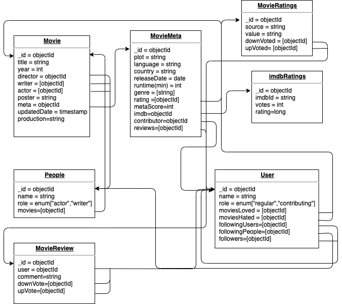

# COMP2406 Movie DB Project

Author of this project:
**Mihir Gupta** (101172281)

Since this top-level README is for describing higher level things for project. We suggest that you also checkout the readme in dirs if you encounter any project specific issues. are some issues when you using them. There shouldn't be any issues since its very simple but who knows. We try to keep notes and important instructions in related dirs to make it easy. We assume that you have working using NodeJS v12.x and NPM installed on your machine.

## Table of Contents

### [COMP2406 Movie DB Project](#comp2406-movie-db-project)
   - [Project Structure](#project-structure)
   - [Project Check - in](#project-check---in)
     - [1 (October 7, 2020)](#1-october-7-2020)
     - [2 (October 27, 2020)](#2-october-27-2020)
   - [Available Scripts](#available-scripts)

## Project Structure
You can start, install and do other housekeeping stuff from top-level since the `package.json` has all that. But if you are developing please [`cd frontend`](/frontend/README.md) or [`cd backend`](/backend/README.md) into whatever project you are working on. Install projects related deps in those folders.
```
.
├── README.md
├── .vscode
├── backend    <-- API
│   ├── README.md
│   ├── package-lock.json
│   ├── package.json
│   ├── src
│   └── tsconfig.json
├── frontend    <-- React App
│   ├── README.md
│   ├── package-lock.json
│   ├── package.json
│   ├── postcss.config.js
│   ├── public
│   ├── src
│   ├── tailwind.config.js
│   └── tsconfig.json
├── package-lock.json
└── package.json
```

## Project Check - in

### #1 (October 7, 2020)

#### A bit about project setup and different things used
As you have seen in [ Project Structure](#project-structure) section we have structured the project to have following dirs:

- [`backend`](/backend/README.md) which is a NodeJS server that uses ExpressJS and written in `TypeScript`. 
  - It runs on `localhost:4000` and has a dummy endpoint that returns name of the project. 
  - We are using a node package `npm-run-all` that makes it easy to run multiple scripts in parallel or in sequence. That is a very handy and useful package since it is important that we can define this order because in `backend` we have to transpile all that TypeScript code to JavaScript.
  - We are also using `nodemon` to have it restart our node server if any of the source files were changed. It makes development easy.
- [`frontend`](/frontend/README.md) which uses the following:
  - `react-scripts` since it is a initialized using [create-react-app](https://create-react-app.dev)
  - We 💙 typed languages. One of the main reasons is it helps us not do dumb things. That is why we chose to write our React App in TypeScript.
  - For styling we are using [TailwindCSS](https://tailwindcss.com)
    - To remove unused styles the final build (this helps reduce size for production app) we have `postcss` that runs with the Tailwind compiler in 
  - Since React app is a Single Page Application (SPA) we are using [`@reach/router`](https://reach.tech/router/) to handle routing
  - For simplifying form validation and managing forms we are using Formik and Yup. This helps us to do all sorts of validation on create account / login and in future other pages where we will have user input.
- Root level of project: We have a top-level `package.json` that uses `npm-run-all` and helps to do some common chores instead of going in to the directory we are working in. The most handy thing is `npm install` in top-level since we download all the dependencies for both `backend` and `frontend` at once. Checkout [Available Scripts section](#available-scripts) or scripts section in `package.json` in root of this project to for more top-level handy scripts.

#### Frontend
This check-in mainly is for setting up things and mocking things. We are using mobile first approach for designing our web application. So most of the pages should look nice on different viewport. Since its not a final product there can be minor issues.  After installing dependencies you can either do `npm run start:frontend` (if on top level) or `npm start` if in frontend directory. It should start a server at `localhost:3000` Following are the pages/routes that you can visit:
- `/`: Homepage
  - Inspired from google's design we want anyone who visits our homepage to search (right now search doesn't work). The search will be powered by our backend. We plan to have fuzzy-search implemented and maybe (need to think more on this) implement search for logged in user such a way that results are optimized based on their old likings and previous searches. 
  - Since search functionally relies on our backend mainly so "Search Movie" button right now will take you to 404 page. Ideally it will be similar to `/movies` page
  - **Next steps**: We will add "Create account/Login" on top-right if user is not logged in otherwise show an avatar. 
- `/login`: Login page
  - This is a simple login page that will let users login
  - If you do `/login?email=dummy@email.com` this will auto fill the email field provided in browser search bar from query params.
  - Right now, once you fill the form and click login it will just create an Alert and you can see JSON object. This object is what will be used in future to pass to the API.
- `/register` Register page
  - Asks user for some Personal Information (PI) and then will send it to backend
    - Backend will register the user
    - Once registered they will get logged in automatically on frontend
    - Right now, once you fill the form and click register it will just create an Alert.
    - Similar to Login page you can also pass in url params like `/register?firstName=Tony&lastName=Stark&email=tony@stark.net` it will fill in corresponding fields in the form.
- `/movies` Movies Listing page
  - This uses the `movie-data-short.json` to mock the page.
  - Hovering over the movie card will change border color. In future versions we plan to add `onTap` animations. 
  - Clicking a movies should take you the movie viewer page `/movies/:moviesName`
- `/movies/:moviesName` Movie Viewer page
  - This is just an empty page for now.
  - If you give any value `:movieName` it will use the get that parameters from the search bar and display that word on screen.
- `/profile` User Profile page
  - Users can see and update their profile information on this page.
  - For now this is just a mock for the page. It includes the following:
    - Name and profile picture (if available)
    - Role of user
    - Recently liked and contributed top 5 table
      - Clicking a title will in list take you to page of that movie
    - As we get more what stats we will have. Will add more tables/charts to show that information.
    - Need to work on editing functionally that will be easily implemented when we start fetching data from our node server.

There are some pages like the Actor/Director profile page that will be easily implemented once we serve content from our Node Server. Since we are currently planning on schema for this that will also work with our GraphQL version of API.
We will also add a navbar once most of our things start to work together using our API.

Not biggies but will probably add them because why not?
* Footer that has about page link that will show author profiles
* For User Experience we are planning to add animations will use [`framer-motion`](https://www.framer.com/motion/)

Above and beyond plans (will talk more in future check-in):
* We are using `React.Suspense` that shows a fallback component if the data is getting fetched. Right now it is `Loading...` we will create skeleton components with loading indicators since it makes good user experience. 
* Our data fetching solution will implement pre-fetching and caching on client.

#### Developer Things
- We develop in Visual Studio Code and this comes with all our workspace settings.
- This project uses ESLint to help us use good practices when we are writing code and avoid issues that are not easily recognized in first review. This also make sure that are styling is consistent.

### #2 (October 27, 2020)
In this check-in we worked on getting up the endpoints ready for are node server. In check-in one all the data was done client side. But in this check-in we use the API to consume the data in our [`frontend`](frontend/README.md). Since we move our data fetching to our API. To see this in action please use the `npm start` command on top-level of this project. It will take care of all build steps and will start both frontend http://localhost:3000 and backend at http://localhost:4000. For more details please read the whole document. 

#### Backend
We have implemented few of the endpoints required by [project requirements](requirements.pdf) and some additions which were needed to fulfill our data needs. To just run the backend, after installing dependencies you can either do `npm run start:backend` (if on top level) or `npm start` if in backend directory. It should start a server at `localhost:4000`. Please checkout the [README in `backend`](backend/README.md#endpoints) directory for detailed documentation of supported endpoints by our nodeJS server written in TypeScript.

We have added `morgan` for logging. This allows us to debug and see all the requests made to our API.

#### Frontend
In previous check-in all the data was handled on client side. We were reading the [`dataset`](dataset/movie-data-short.json) on client to show data. But now we are using our API to fetch the data needs for the client. We are doing client side data fetching (aka Ajax) to get content to our pages. 

The major change we have made from our initial routing on client to now is that we use the UUID instead of taking in a string like title of the movie. Since our backend endpoint only supports (for now) getting something by ID we have changed the router so that we can use the URL params to make API requests to our backend and get the data.

NOTE: The below routes only outlines the breaking changes from previous check-in.

- `/profile` All User Profile page
  - You can see profile cards of all different users currently registered.
  - Clicking a user card will take you to the user profile page.
- `/profile/:userId` Profile of a specific user
  - This is similar to the old `/profile` route as described in [check-in 1](#1-october-7-2020)

#### Database
Based on requirements we have designed the following schema for our backend. This design helps us design endpoints and [initialization scripts](#initialization-scripts).


#### Initialization Scripts
This is work in progress and it will probably change. Idea is to read the [`dataset files provided`](dataset/README.txt) and batch them in format that will follow the [schema for our database](db.png). You can try these scripts out `cd backend && npm run db`. This is just prototyping stage so we print to the console with the small dataset provided. Right now we read the data set and make object as shown in "People" collection of our DB schema.

Right now our scripts are not the most efficient. Reason is that we are iterating over the dataset and filtering out the key we want and then store that info in temporary object and then push that object to array. Each time we run our function it gets expensive. Since this all is done once and not matter much but this is something we are still thinking on how to implement in a way that doesn't take too long when initialling. 

There are many things that we need to work on. Some of improvements we would like to add in next check-in:
- Error Checking for API - Currently we did not spend too much time since validation and all are easily taken care when our mongo is initialized properly.

### #3 (November 13, 2020)

In this check in I have focused on adding some new stuff in the frontend, so that it is easy for anyone using this project to navigate to and from pages. I have also linked my front end with the backend business logic. I have created almost all the endpoints for this project. For this check in also, I have not linked the MongoDB database. More stuff is explained below, I will explain what I have added in my frontend, backend and what else is left for final project submission.

#### Backend

I have created almost all the endpoints. I have imported the navbar in routes file and also added links to pages in navbar component using link from `reach/router`. 

Now after registering, the register page is navigated to the log in page instead of profile page. On Registration now Emails and Passwords are also sent to server so that it can be later used for logging in.

Changed the body parser to express.json in `index.tsx` in backend as it is deprecated but both works more or less same.

Also if a user now tries to go on any page without logging in the user will be redirected to log in page.

Now, when user tries to log in using email and password, I send a request to backend for logging in with email and password, if the information given is correct the server sends 200 and user gets to profile and if 400 the user stays out at login page. 


#### Frontend

I have added much stuff in the frontend. I have designed my backend the way it will keep on prompting user to log in first then use the project, if you don't have account you register your account first then you can log in from the account and use the project. 

My whole frontend is done in react.js, however some of the styling is done with css, and some with bootstrap, even I am using tailwind for many of my pages. I deliberately did this because I wanted to learn three of them, so this was the best way I could learn all of them with implementing it the way I want.

I have added the Navigation Bar, this will make easier for someone who is using this project to navigate to and from pages.

## New Pages Added in frontend

`Edit Profile` : User can go and edit the role from contributing to regular or vice versa.

`Add User` : You can register a new user here. (Extra stuff)

`Movie View` : This page will be viewed after you search a movie in search box and selecting the category.

`Add Movie` : This page will only let Contributing user to add a movie, if the user's role is regular movie will not be added, it will trow an alert saying "Please change your role to add a movie".

`Users` : You can view the any user from this page (As in Previous check in #2)

#### Stuff to be done in final

I have to manage the follow thing by users, viewing the followers and unfollow the whoever they want, and send the notification to user if one of it's following adds a movie or writes a review. 

Writing a review on movies by contributing users.

Linking the MongoDB to the project. 


## Available Scripts
`npm run [command]`
Available Commands
```
dev         Run dev server that will restart automatically (Starts Frontend and Backend)
build       Create a production builds
clean       Run clean commands (where applicable)
start       Run production version of backend and dev for frontend
lint        Run eslint frontend + backend
```
